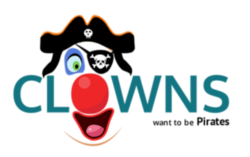
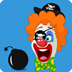

## JavasScript Game: Clowns Want to be Pirates

### [View Demo](https://stevesohcot.github.io/clowns-want-to-be-pirates/)

Playable in a web browser, this JavaScript game was originally in a mobile app "shell."  Not being a *native* app, the game was a little clunky.

Figured I'd share the code, if anyone wanted to create their own theme by swapping out the images.

### Original game description:

> Clowns want to be pirates!  But the pirates don't want to give up their treasure.  Navigate the clown ship to pick up other clowns and the treasure, but avoid the bombs set out by the pirates!

### Game Icon:

### [View Demo](https://stevesohcot.github.io/clowns-want-to-be-pirates/)